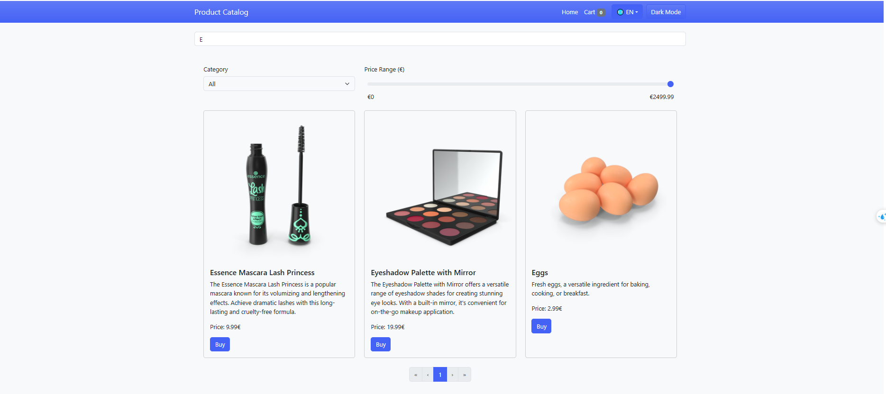
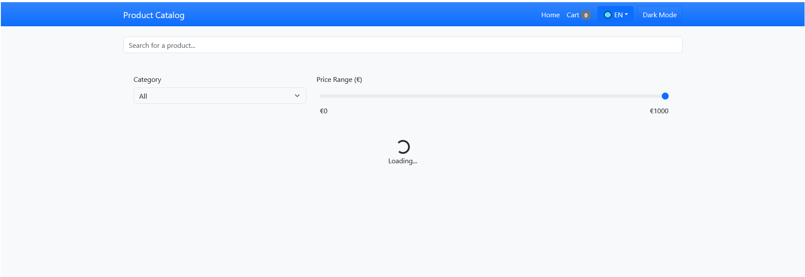
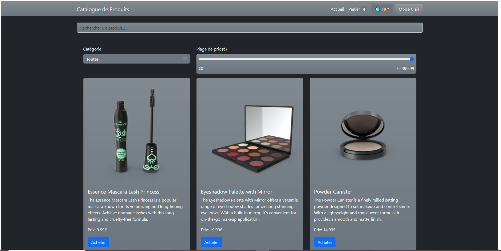
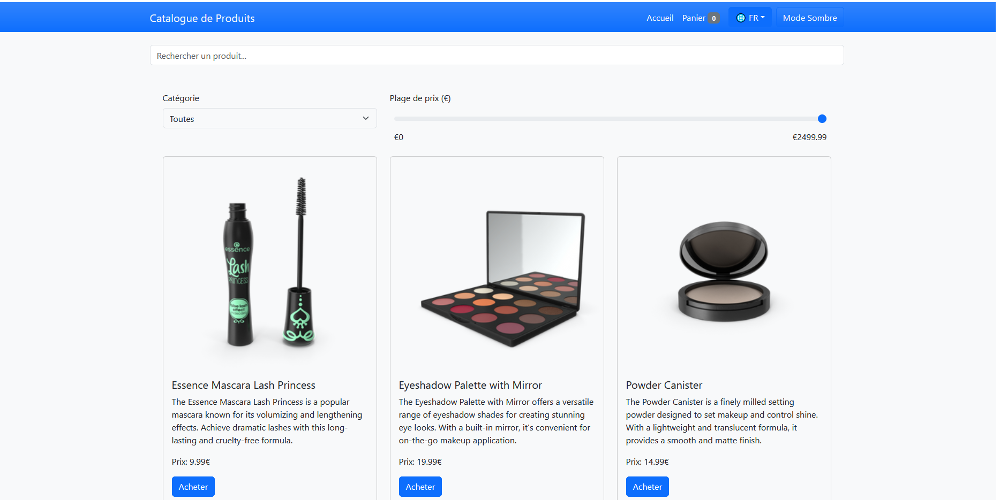
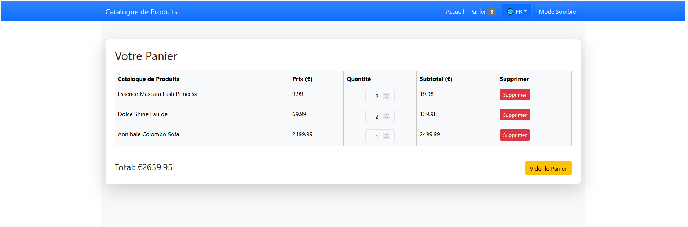
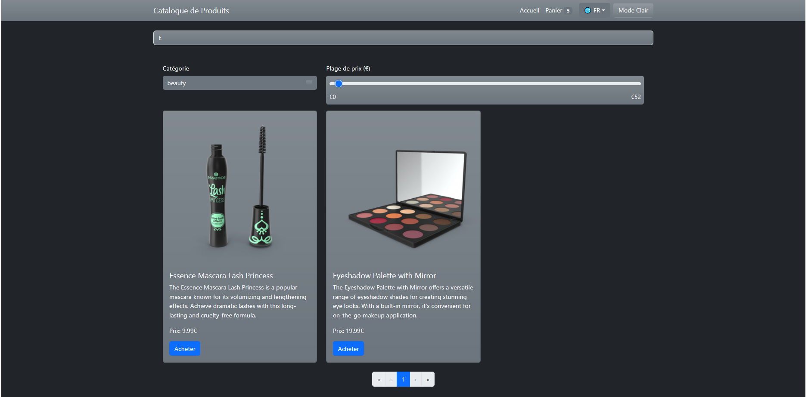
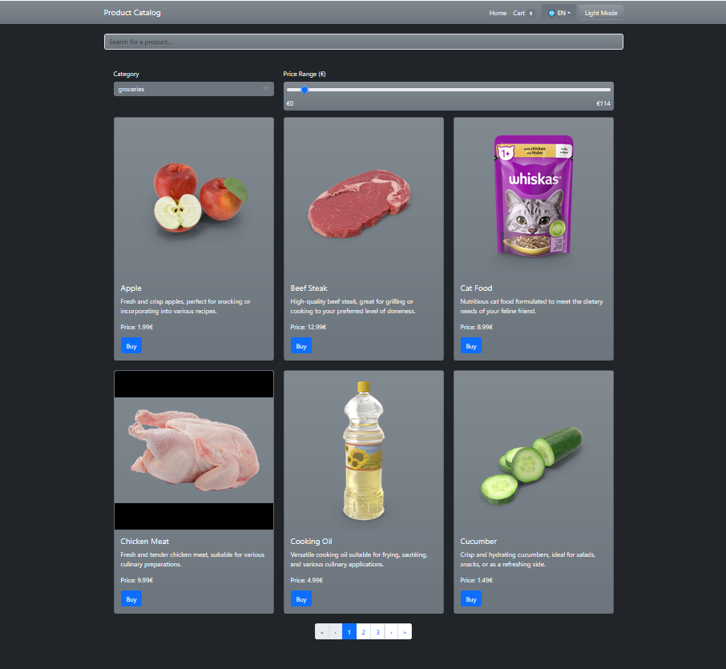

# TP React Hooks - Application de Gestion de Produits

Ce TP a pour objectif de mettre en pratique l'utilisation des Hooks React (useState, useEffect, useContext) ainsi que la création de Hooks personnalisés.

## Installation et configuration initiale

1. Cloner le dépôt :
```bash
git clone https://github.com/pr-daaif/tp-react-hooks.git
cd tp-react-hooks
```

2. Créer votre propre dépôt sur Github et changer le remote :
```bash
# Supprimer le remote origine
git remote remove origin

# Ajouter votre nouveau remote
git remote add origin https://github.com/[votre-username]/tp-react-hooks.git

# Premier push
git push -u origin main
```

3. Installer les dépendances :
```bash
npm install
```

4. Lancer l'application :
```bash
npm start
```


### Exercice 1 : État et Effets 
#### Objectif : Implémenter une recherche en temps réel

Utilisation de useState et useEffect pour gérer la recherche en temps réel.
Implémentation du hook useDebounce pour limiter les appels réseau pendant la saisie.
Application de la méthode startsWith() pour filtrer les produits dont le titre commence par le terme recherché.
### 🖼️ Captures d'écran :
 
  

### ⚠️ Difficultés rencontrées et solutions :
Problème : Les résultats s'affichaient trop rapidement ➔ Solution : Ajout du debounce
Problème : La recherche renvoyait des résultats partiels ➔ Solution : Utilisation de startsWith()

### Exercice 2 : Context et Internationalisation
#### Objectif : Gérer les préférences de langue

Création d'un LanguageContext pour gérer les préférences de langue.
Ajout d'un sélecteur de langue dans la Navbar pour basculer entre le français et l'anglais.
Utilisation de fichiers de traduction pour afficher dynamiquement les textes selon la langue sélectionnée.
### 🖼️ Captures d'écran :
  
   

### ⚠️ Difficultés rencontrées et solutions :
Problème : La langue ne persistait pas si on Refresh la Page ➔ Solution : Stockage dans localStorage
### Exercice 3 : Hooks Personnalisés
#### Objectif : Créer des hooks réutilisables
useDebounce : Retarde l'exécution d'une fonction pour éviter les appels réseau excessifs lors de la saisie.
useLocalStorage : Permet de sauvegarder et récupérer des valeurs dans le localStorage (thème, langue, panier).
### 🖼️ Captures d'écran :
 
  
  
### ⚠️ Difficultés rencontrées et solutions :
Problème : useLocalStorage ne mettait pas à jour le state automatiquement ➔ Solution : Utilisation de useEffect pour surveiller les changements
Problème : Déclenchement trop rapide de la recherche ➔ Solution : Ajustement du délai dans useDebounce


### Exercice 4 : Gestion Asynchrone et Pagination
#### Objectif : Gérer le chargement et la pagination
Utilisation de useEffect pour charger les données via une API externe.
Ajout d'un spinner pour indiquer le chargement des données.
Mise en place d'une pagination dynamique avec contrôle du nombre de produits par page.
### 🖼️ Captures d'écran :

 
 

### Conclusion:
 
Ce projet m'a permis de mettre en pratique les **concepts fondamentaux de React** tels que l'utilisation des **Hooks** (`useState`, `useEffect`, `useContext`) ainsi que la création de **hooks personnalisés** pour répondre à des besoins spécifiques comme la gestion du **localStorage** et l'optimisation de la **recherche en temps réel** avec un **debounce**.
